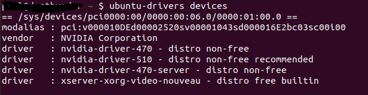
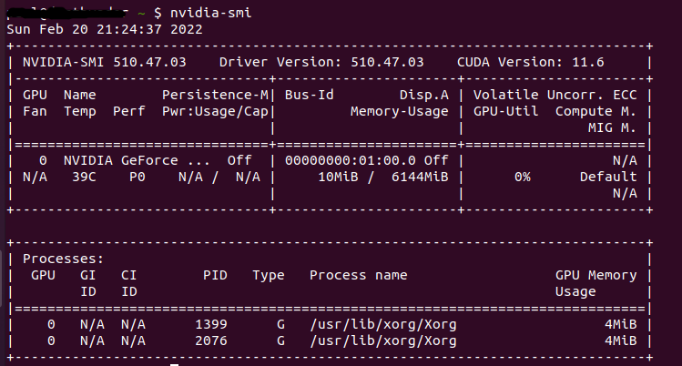
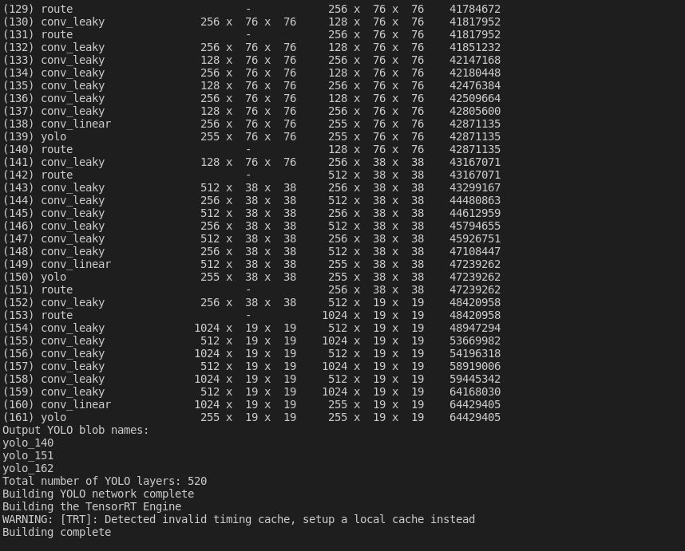
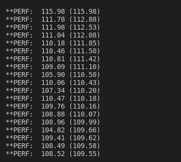
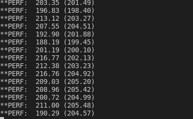
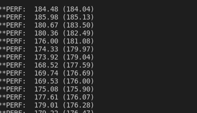
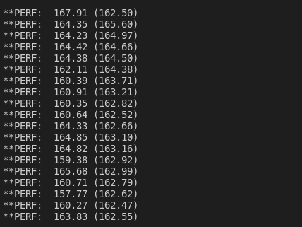

# Running YOLOv4 on Deepstream 6

Deepstream is a highly optimized video analysis pipeline developed by NVIDIA. It is based on GStreamer and highly optimized to run on the NVIDIA GPU. As everything runs on the GPU, this results in fast video processing as the images never leave the GPU. NVIDIA has created some plugins where you can run ML inference models and multi-object tracking. In this tutorial, we will describe how to evaluate the latest Deepstream 6 using docker and learn how to run the YOLOv4 model. The examples were tested in Ubuntu 20.04 and RTX3060 and based on [1].


## Setup

To start, we need to ensure we have the NVIDIA driver setup for the graphics card. You could install it manually by downloading the run script from the NVIDIA website or using the command line. In this example, we will be using the command line

Before we start, get the information about the system graphics card and available drivers.

```
ubuntu-drivers devices
```

It will show the available drivers for the graphics card.



Auto-install the driver.

```
sudo ubuntu-drivers autoinstall
```

Once the driver is installed, reboot the system.

```
sudo reboot
```

After reboot, check if the driver is installed properly.

```
nvidia-smi
```



Next, we install docker.

```
sudo apt install apt-transport-https ca-certificates curl software-properties-common
curl -fsSL https://download.docker.com/linux/ubuntu/gpg | sudo apt-key add -
sudo add-apt-repository "deb [arch=amd64] https://download.docker.com/linux/ubuntu focal stable"
sudo apt install docker-ce

```

Once docker is installed, modify the docker daemon.json to include the NVIDIA container runtime.

```
{
    "runtimes": {
        "nvidia": {
            "path": "nvidia-container-runtime",
            "runtimeArgs": []
        }
    }
}
```

Restart docker

```
sudo systemctl restart docker.service
```

Clone the following repo https://github.com/ubergeekNZ/deepstream6-example. This repo contains all the config files for running the examples. To learn about each entry in the config file, check out [3].

Create a data folder and download video TownCentreXVID.mp4 from the Kaggle website, and place it into the data folder.
https://www.kaggle.com/ashayajbani/oxford-town-centre/version/4

Pull the latest Deepstream container. This will take you into a bash shell inside the container.

```
docker run --gpus all -it --rm -v $PWD:/opt/nvidia/deepstream/deepstream/sources/project -w /opt/nvidia/deepstream/deepstream/sources/project nvcr.io/nvidia/deepstream:6.0-devel
```

Once inside the container, run the ResNet example.

```
deepstream-app -c configs/deepstream_basic.txt
```

The resultant video is created in the data folder, towncentre_out.mp4.


## Running YOLOv4 model

Download the YOLOv4 weights, configs, and labels in the project folder.

```
apt update && apt install wget
mkdir weights && cd weights
wget https://github.com/AlexeyAB/darknet/releases/download/darknet_yolo_v3_optimal/yolov4.weights
wget https://raw.githubusercontent.com/AlexeyAB/darknet/master/cfg/yolov4.cfg
cd /opt/nvidia/deepstream/deepstream/sources/project/configs
wget https://raw.githubusercontent.com/marcoslucianops/DeepStream-Yolo/master/labels.txt 
```

We have to create the YOLOv4 custom Nvinfer plugin for Deepstream 6. To do this we have to clone the repo into the project folder.

```
git clone https://github.com/marcoslucianops/DeepStream-Yolo.git
```

Once cloned, build the custom plugin.

```
cd /opt/nvidia/deepstream/deepstream/sources/project/DeepStream-Yolo
CUDA_VER=11.4 make -C nvdsinfer_custom_impl_Yolo
```

Run the YOLOv4 example.

```
deepstream-app -c configs/deepstream_yolo.txt
```

During the running of Deepstream, the YOLOv4 model is converted to a TensorRT engine plan file.



Once the TensorRT engine plan file is built, it runs the YOLOv4 model on the video.

The deepstream throughput is approx. 110 fps.



The output video.


# Tracker

Let's speed the object detection up by combining multi-object trackers.

To increase the fps of the pipeline, we skip a couple of frames and use the multi-object tracker. There are three trackers provided in Deepstream and they are IOU, NvDCF, and Deepsort. NvDCF is NVIDIA proprietary tracker. To learn about the trackers in Deepstream, check out the NVIDIA website. In the following examples, we will be skipping three frames.

## IOU Tracker

The IOU tracker is a bare minimum object tracker using intersection of union and logic to reduce false positives and false negatives. 

Run the IOU tracker.

```
deepstream-app -c configs/deepstream_yolo_iou.txt
```
The deepstream throughput has doubled to approx. 200 fps.



The output video


## NvDCF Tracker

"The NvDCF tracker is an NVIDIA®-adapted Discriminative Correlation Filter (DCF) tracker that uses a correlation filter-based online discriminative learning algorithm for visual object tracking capability while using a data association algorithm and a state estimator for multi-object tracking." [8]

Run the NvDCF tracker.

```
deepstream-app -c configs/deepstream_yolo_nvdcf_tracker.txt
```
The deepstream has reduced to 180 fps as due to the processing to increase accuracy.



The output video


## Deepsort Tracker

DeepSORT tracker is a re-implementation of the official DeepSORT tracker used in Deepstream. DeepSORT implementation uses deep cosine metric learning with a Re-ID neural network.
 
To use the Re-ID network, we have to download Re-ID model networks/mars-small128.pb and convert it to a format that Deepstream can use to generate the TensorRT engine plan file.

First download mars-small128.pb from the DeepSORT Github repo, https://github.com/nwojke/deep_sort.
To use the converter tools, we need to install TensorFlow. 

Install TensorFlow. NVIDIA recommends 1.15 but 1.14 works as well.

```
pip3 install tensorflow-gpu==1.14 
```

Copy the mars-small128.pb to the tracker_deepsort folder.

```
cp mars-small128.pb /opt/nvidia/deepstream/deepstream/sources/tracker_DeepSORT/
```

Run the converter script

```
cd /opt/nvidia/deepstream/deepstream/sources/tracker_DeepSORT/
python3 convert.py mars-small128.pb
```

Copy mars-small128.uff back to the project folder.

```
cp mars-small128.uff /opt/nvidia/deepstream/deepstream/sources/project
cd /opt/nvidia/deepstream/deepstream/sources/project/
```

Run the DeepSORT example.

```
deepstream-app -c configs/deepstream_yolo_deepsort.txt
```

The fps has dropped to approx. 160fps.



The output video


Summary
Hopefully, the examples above demonstrate how to set up Deepstream 6, and run an object detector like YOLOv4. It also shows how to integrate the built-in multi-object trackers and improve the throughput of the system.

References:

[1] https://blog.ml6.eu/nvidia-deepstream-quickstart-9147dd49a15d

[2] https://developer.nvidia.com/deepstream-sdk

[3] https://docs.nvidia.com/metropolis/deepstream/dev-guide/text/DS_ref_app_deepstream.html

[4] https://github.com/AlexeyAB/darknet

[5] https://github.com/marcoslucianops/DeepStream-Yolo

[6] https://www.digitalocean.com/community/tutorials/how-to-install-and-use-docker-on-ubuntu-20-04

[7] https://linuxconfig.org/how-to-install-the-nvidia-drivers-on-ubuntu-20-04-focal-fossa-linux

[8] https://docs.nvidia.com/metropolis/deepstream/dev-guide/text/DS_plugin_gst-nvtracker.html

[9] https://github.com/nwojke/deep_sort